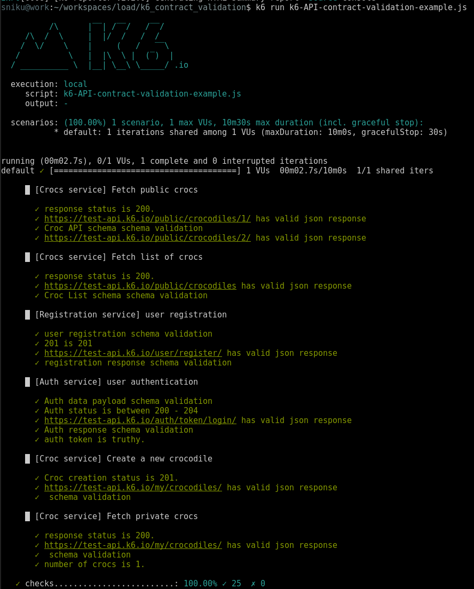

# k6 API contract validation example

This is a complete example of API contract validation in k6 using the [expect](https://k6.io/docs/javascript-api/jslib/expect/) library.

Contracts are stored in [./api_contracts](./api_contracts) folder as `.js` files.
Contracts can also be standard `.json` files if there's no need to compose complex contracts from multiple objects.

### Contract format
API contracts follow the JSON Schema format. Under the hood, the [expect library](https://k6.io/docs/javascript-api/jslib/expect/) is using [Ajv JSON schema validator](https://github.com/ajv-validator/ajv) developed by Mozilla. 

### About this example

The [example script](./k6-API-contract-validation-example.js) validates API contracts of selected services from [https://test-api.k6.io/](https://test-api.k6.io/). 

### Screenshots

`k6 run k6-API-contract-validation-example.js`

`k6 cloud k6-API-contract-validation-example.js`

